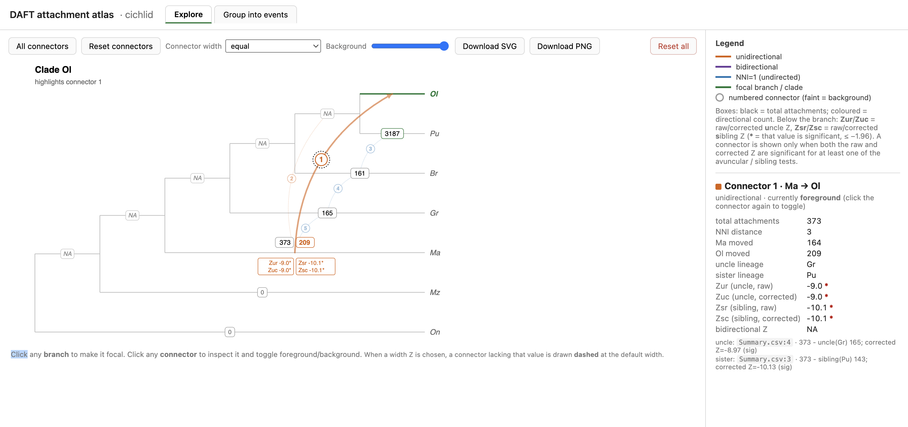

# What this is and isn't

This is something I built over a few afternoons with Claude. I use it to explore results from DAFT, and to try and make sense of introgression events. I built it for me, and have no particular intentions to attempt to make it good software, or the kind of thing that will generalise to lots of use cases beyond what I need it for. I have tested it extensively on my own data (e.g. the data from the DAFT paper) but not on other datasets. I have no intention to modify or extend this beyond my own usage, and no intention at all to maintain it if I'm not using it. In other words - I'm putting this up in case it's helpful, but use it at your own risk, and definitely check that what the viewer puts on the screen corresponds to what DAFT is actually telling you (i.e. study the output files!).

I encourage you to fork this and modify it in any way you like. Claude is very competent at building modifications. Feel free to leave things on the issues, but be aware that I almost certainly won't have time to address any of them.

The rest of this readme is written primarily by Claude. I've read it, it's correct. It's not how I'd have written it!

# daft-viewer

An interactive, self-contained viewer for [DAFT](https://github.com/smishra677/DAFT) introgression results.

DAFT detects **candidate introgression pairs** between branches of a species tree. This tool turns a DAFT run into a single HTML file with two tabs:

- **Explore** — click any branch to focus it; the connectors pointing into it light up with their attachment counts and uncle/sibling Z-scores.
- **Group into events** — bundle the candidate connectors into your best-guess introgression *events* (one real event can produce several DAFT pairs), and export the grouping.



There are two pieces:

| piece | what it does | needs |
|---|---|---|
| `build_atlas.py` | reads three DAFT output CSVs → writes one self-contained `.html` | Python + `numpy` + `ete3` |
| the `.html` | the interactive viewer | **just a web browser** (no install, works offline) |

---

## Just want to look?

Open **[`example/attachment_atlas.html`](example/attachment_atlas.html)** in any browser. It's the bundled cichlid example (Gante et al. 2016) — nothing to install.

---

## Quickstart (mamba / conda)

```bash
git clone https://github.com/roblanf/daft-viewer.git
cd daft-viewer
mamba env create -f environment.yml      # or: conda env create -f environment.yml
mamba activate daft-viewer
python build_atlas.py --dataset cichlid  # builds attachment_atlas.html from ./example
open attachment_atlas.html               # macOS; use xdg-open / just double-click elsewhere
```

That rebuilds the bundled cichlid example from its DAFT CSVs and opens the viewer.

---

## Installing

Pick whichever you prefer — the only Python dependencies are `numpy` and `ete3`.

- **conda / mamba (recommended)** — `ete3` installs most reliably this way:
  ```bash
  mamba env create -f environment.yml && mamba activate daft-viewer
  ```
- **pip** (into a virtualenv of your choice):
  ```bash
  pip install -r requirements.txt
  ```

(The viewer HTML needs none of this — only `build_atlas.py` does.)

---

## Building from your own DAFT run

The viewer reads **three** files produced by a DAFT run:

| file | what it is |
|---|---|
| `rev_n.csv` | discordant attachment counts + NNI distance per pair |
| `results1.csv` | DAFT Direction / djiNNI output (donor / recipient) |
| `Summary.csv` | detection Z-scores (uncle & sibling, raw + corrected) |

DAFT can append a run label to its output filenames (e.g. `Summary_gante.csv`). The builder
ignores any such `_<suffix>`, so you can point it straight at a labelled run — it just needs
exactly one match per file (otherwise use `--rev-n / --results1 / --summary`).

Put them in one folder and point the builder at it:

```bash
python build_atlas.py --daft-dir /path/to/your/DAFT/outputs --dataset myrun
```

…or point at each file individually with `--rev-n / --results1 / --summary`. It writes a self-contained `attachment_atlas.html` (plus an intermediate `atlas_data.json`). See `python build_atlas.py --help` for all options.

> A connector is only drawn when **both** the raw and corrected Z are significant (≤ −1.96) for at least one of the avuncular / sibling tests, following the DAFT recommendation. This means your DAFT run must have correction enabled (`--correct 1`) so `Summary.csv` carries the `*_corrected_scaled_down` Z columns — the builder stops with an explanatory error if they're missing.

---

## Using the viewer

### Explore tab
The coloured arcs are **connectors** — each is one candidate pair (**orange** = a direction was inferred, **purple** = bidirectional, **blue** = NNI=1 / direction not inferable).

- **Click a branch** → it turns green (focal); its incoming connectors light up and number boxes appear on the partner branches: above = total attachments (+ recipient move count); below, two lines per test — `Zur`/`Zuc` = raw/corrected **u**ncle Z, `Zsr`/`Zsc` = raw/corrected **s**ibling Z (`*` = significant).
- **Click a connector** → full details in the right-hand panel (counts, the uncle/sister lineages, every Z, and the exact `Summary.csv` line each came from).
- **Connector width** dropdown — scale thickness by a chosen Z; **Background** slider — fade non-focal connectors down to invisible to declutter dense trees.

### Group into events tab
A **connector** is one pair DAFT reported; an **event** is *your* grouping of one or more connectors into a single introgression episode.

- **+ Add event**, then click connectors (on the card's tree or in its checklist) to add them — or **click a branch** to add all of that branch's incoming/touching connectors at once. Rename / recolour / delete each event.
- The **top panel** tallies how many events each connector is in; the **table** lists inclusion counts and flags what's unassigned or shared.
- Your grouping **auto-saves** in the browser; **Save / Load grouping** (JSON), **Table CSV**, and **Figure SVG/PNG** export it.

---

## The example data

`example/` holds the cichlid (Gante et al. 2016) DAFT output. It was generated with:

```bash
daft-test \
  --sp "$(cat cichlid_species_tree.txt)" \
  --gt "cichlid_gene_trees.csv" \
  --output "cichlid_corrected" \
  --sibling 1 --excel 1 --correct 1 --direction 1
```

`rev_n.csv`, `results1.csv` and `Summary.csv` are the three files the viewer reads; `example/attachment_atlas.html` is the prebuilt viewer for them.

---

## License

MIT — see [LICENSE](LICENSE).
